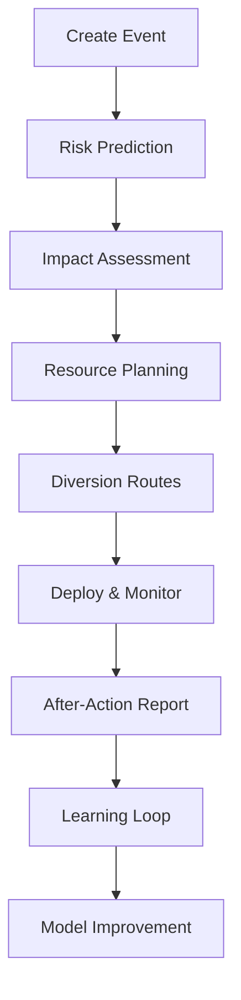
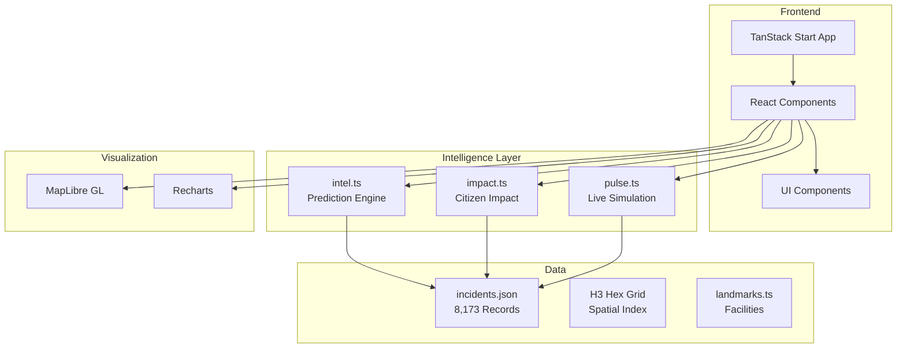

# 👁 NETHRA

**Eyes on the city** — Smart City Traffic Operating System for Bengaluru

<div align="center">


[Live Demo](https://nethra-demo.vercel.app) · [Report Issue](https://github.com/Pragati1466/Nethra/issues)

</div>

---

## What is NETHRA?

NETHRA is an operational decision-making platform for traffic police, planners, and emergency response in Bengaluru. It transforms raw incident data into actionable intelligence through predictive modeling, spatial analysis, and real-time simulation.

**Key Capabilities:**
🎯 **Predictive Risk Modeling** – Score events (0-100) based on 8,173+ historical incidents
🗺️ **Digital Twin** – 168-hour traffic replay with H3 hex grid spatial analysis
🚨 **Impact Assessment** – Calculate citizen impact, economic loss, and emergency access risk
🚦 **Smart Diversion Planning** – Traffic-aware alternate route generation
⚡ **Live Operations Pulse** – Real-time simulation of units, corridors, and alerts
🤖 **AI Strategist** – Chat-based assistant for scenario analysis

---

## Quick Start

```bash
# Clone the repository
git clone https://github.com/Pragati1466/Nethra.git
cd Nethra

# Install dependencies (using Bun for speed)
bun install

# Start development server
bun run dev
```

Visit `http://localhost:5173` to see the application.

---

## How It Works



**Workflow:**
1. **Create Event** – Enter event details (location, crowd, duration)
2. **Risk Prediction** – AI calculates risk score based on historical data
3. **Impact Assessment** – Quantifies citizen impact and economic loss
4. **Resource Planning** – Recommends officers, barricades, and patrols
5. **Diversion Routes** – Generates traffic-aware alternate routes
6. **Deploy & Monitor** – Go live with real-time unit tracking
7. **After-Action Report** – Compare predicted vs actual outcomes
8. **Learning Loop** – Model improves with every closed event

---

## Key Pages

| Page | Purpose |
| ---- | ------- |
| **Command Center** (`/`) | Live operations dashboard with risk-ranked events |
| **Digital Twin** (`/twin`) | 168-hour traffic replay with H3 hex grid |
| **Create Event** (`/events/new`) | Plan new events with risk prediction |
| **Event Details** (`/events/:id`) | View event details, impact, and deployment status |
| **AI Strategist** (`/strategist`) | Chat-based AI assistant for scenario analysis |
| **Diversion Planner** (`/diversion`) | Traffic-aware route planning |
| **Resource Optimization** (`/resources`) | Officer and barricade allocation |
| **Learning Dashboard** (`/learn`) | Model performance and accuracy tracking |
| **Demo Mode** (`/demo`) | 90-second cinematic demo of all features |

---

## Tech Stack

- **Framework:** TanStack Start (React-based SSR)
- **Language:** TypeScript 5.8
- **Styling:** Tailwind CSS v4
- **Maps:** MapLibre GL + H3-js (hexagonal spatial indexing)
- **Charts:** Recharts
- **State:** TanStack Query
- **UI Components:** Radix UI
- **Build:** Vite + Nitro (for Vercel deployment)

---

## Architecture


---

## Development

```bash
# Install dependencies
bun install

# Run development server
bun run dev

# Build for production
bun run build

# Lint code
bun run lint

# Format code
bun run format
```

---

## License

MIT License – see [LICENSE](LICENSE) file for details.

---

## Acknowledgements

- **TanStack** – React framework and tooling
- **MapLibre GL** – Open-source map visualization
- **Uber H3** – Hexagonal spatial indexing
- **Radix UI** – Accessible component primitives
- **Bengaluru Traffic Police** – Domain expertise

---

<div align="center">

Made with ❤️ for Bengaluru Traffic Police

[GitHub](https://github.com/Pragati1466/Nethra) · [Report Issue](https://github.com/Pragati1466/Nethra/issues)

</div>
