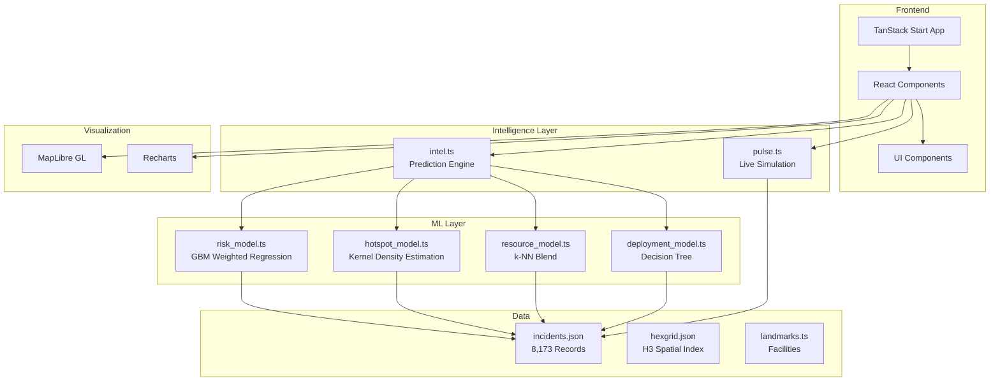
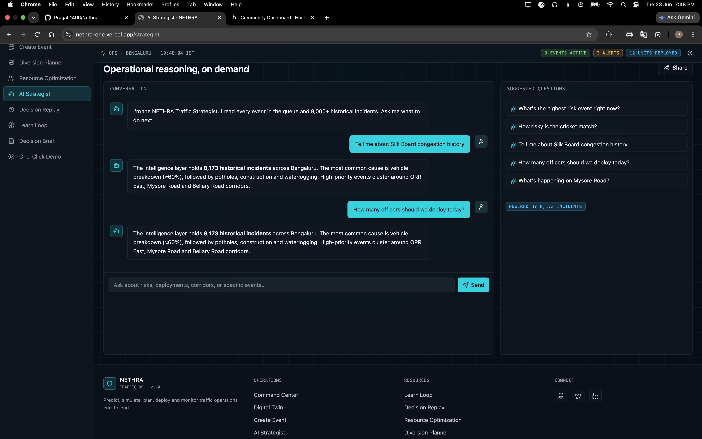
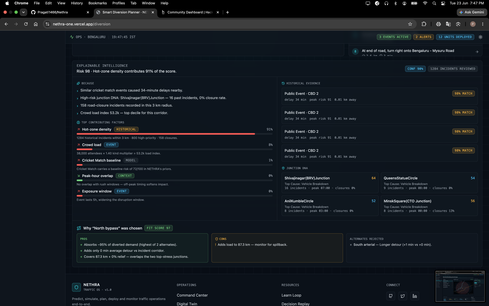
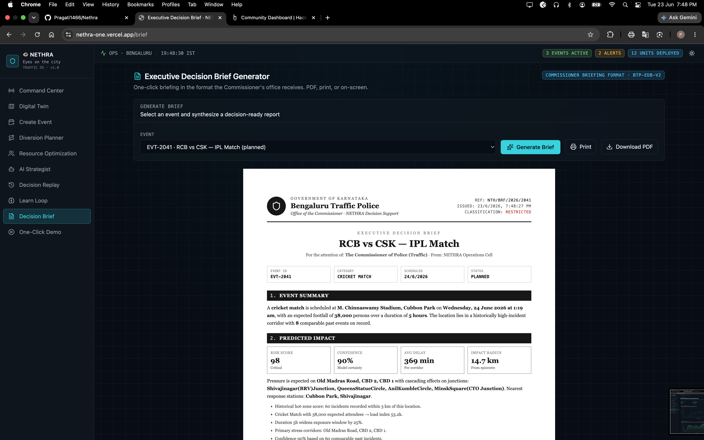
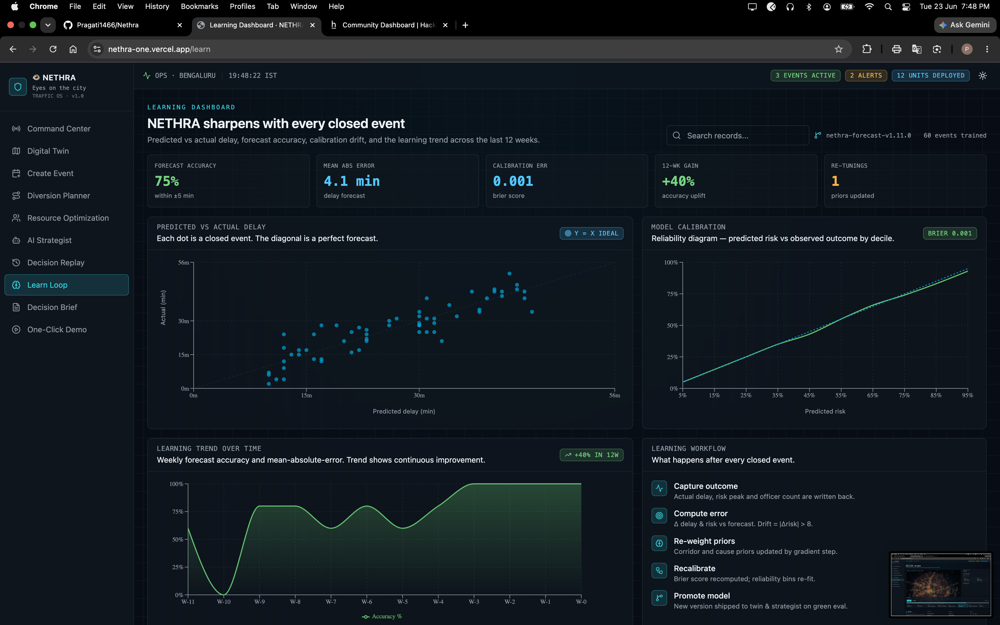
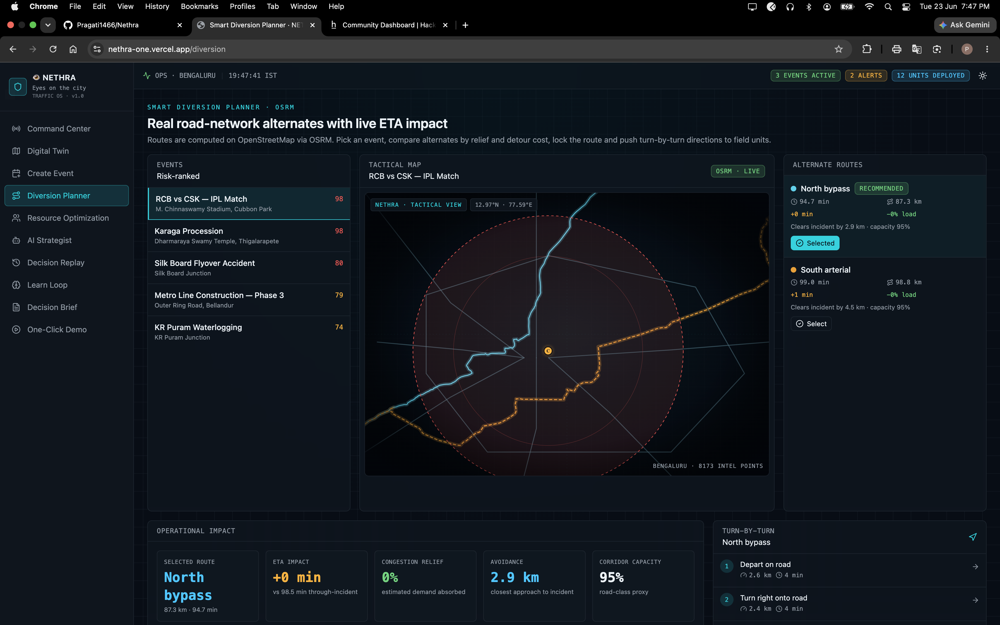
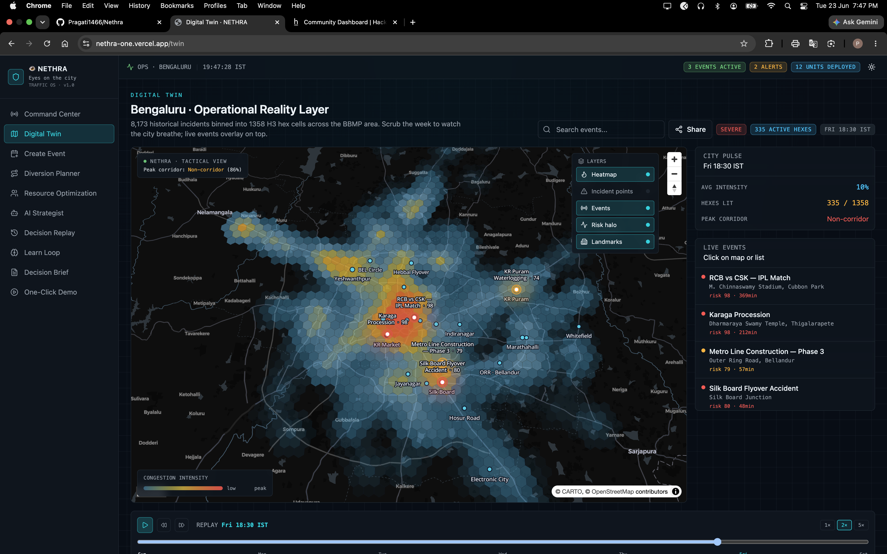

<p align="center">
  
  
  
  
  
  
</p>

<h1 align="center">👁 NETHRA</h1>

<p align="center">
  <strong>Smart City Traffic Operating System for Bengaluru</strong>
</p>

<p align="center">
  <em>An operational decision-making platform for traffic police, planners, and emergency response that transforms raw incident data into actionable intelligence through predictive modeling, spatial analysis, and real-time simulation.</em>
</p>

---

## 📋 Table of Contents

- [Overview](#-overview)
- [Core Capabilities](#-core-capabilities)
- [Dashboard Modules](#-dashboard-modules)
- [Architecture](#-architecture)
- [Dashboard Previews](#-dashboard-previews)
- [ML Model Integration](#-ml-model-integration)
- [Tech Stack](#-tech-stack)
- [Getting Started](#-getting-started)
- [Project Structure](#-project-structure)
- [How It Works](#-how-it-works)

---

## 🎯 Overview

NETHRA is a production-grade traffic command center platform built for **Bengaluru traffic police**. It ingests a real incident dataset (Astram) with 8,173+ historical records, processes it through a multi-stage ML pipeline, and serves an interactive operator console where personnel can:

- **Predict** event risk scores (0–100) using gradient-boosted weighted regression
- **Visualize** traffic patterns through a 168-hour digital twin with H3 hex grid spatial analysis
- **Assess** citizen impact, economic loss, and emergency access risk
- **Plan** smart diversion routes with traffic-aware alternate routing
- **Deploy** resources using ML-powered recommendations for officers, barricades, and patrols
- **Monitor** live operations through a real-time pulse simulation
- **Analyze** historical patterns through interactive learning dashboards

The system operates as a single-page React application with all ML models loaded into memory at startup for sub-second inference, trained on historical Bengaluru traffic incident data.

---

## 🔥 Core Capabilities

| Capability | Description |
|:---|:---|
| **Predictive Risk Modeling** | Gradient-boosted weighted regression model that scores events (0–100) based on 8,173+ historical incidents, using spatial hotspot analysis, crowd pressure indexing, temporal risk factors, and cause pattern learning. |
| **Digital Twin Replay** | 168 hour traffic replay with H3 hexagonal spatial indexing (res-9) that visualizes incident density, corridor stress, and temporal patterns across Bengaluru's road network. |
| **Impact Assessment** | Quantifies citizen impact radius, estimated delay minutes, affected junctions and corridors, and economic loss projections using kernel density estimation. |
| **Graph-Based Diversion Routing** | Dijkstra algorithm on road network graph for shortest path routing with edge severance at incident locations, computing bypass routes through damaged graph. |
| **TSP Patrol Route Optimization** | Traveling Salesman Problem solver using greedy nearest-neighbor initialization with 2-opt local search refinement for multi-incident patrol routing. |
| **Smart Diversion Planning** | Traffic aware alternate route generation that considers corridor load, capacity constraints, and historical closure patterns to recommend optimal bypass routes. |
| **ML Resource Deployment** | k-NN blend model that recommends optimal officer count, barricade count, patrol units, and mobile units based on risk score, crowd size, duration, and historical incident patterns. |
| **Decision Tree Deployment Planning** | Learned decision tree structure that outputs staged deployment plans (pre-event, on-event, post-event) with specific actions, timings, and priorities across ALPHA/BRAVO/CHARLIE tiers. |
| **Unit Assignment History** | Immutable tracking of field unit assignments to events with timestamps, showing which units were assigned, when they arrived, and when they were released. |
| **Live Operations Pulse** | Real-time simulation of field units, corridor congestion, feed streams, and alerts that updates every 2.5 seconds to provide a live city feel. |
| **Immutable Audit Trail** | IndexedDB-based logging of all system actions (predictions, diversions, deployments) with timestamps, response times, and export capability. |
| **AI Strategist** | Chat-based assistant for scenario analysis that provides explainable predictions with factor decomposition, similar historical outcomes, and junction DNA analysis. |
| **Learning Dashboard** | Model performance tracking with predicted vs actual comparisons, weekly accuracy trends, calibration bins, and historical performance ledger. |
| **Fullscreen Map Mode** | Expandable map view for better visibility with toggle button and responsive layout adjustments. |

---

## 📊 Dashboard Modules

| # | Module | What it does |
|:---:|:---|:---|
| 1 | **Command Center** | Live operations dashboard with risk-ranked events, real-time corridor congestion, field unit tracking, and alert streaming. |
| 2 | **Digital Twin** | 168-hour traffic replay with H3 hex grid spatial analysis, incident density visualization, and temporal pattern exploration. |
| 3 | **Create Event** | Plan new events with ML-powered risk prediction, impact assessment, and resource recommendations. |
| 4 | **Event Details** | View event details, impact analysis, deployment status, diversion routes, unit assignment history, and ML explainability. |
| 5 | **AI Strategist** | Chat-based AI assistant for scenario analysis with explainable predictions and factor decomposition. |
| 6 | **Diversion Planner** | Traffic-aware route planning with graph-based Dijkstra routing, capacity analysis, detour time estimation, and corridor coverage mapping. |
| 7 | **Resource Optimization** | City-wide resource roll-up showing officer, barricade, and patrol allocation across all events. |
| 8 | **Patrol Routes** | TSP-based multi-incident patrol route optimization with greedy nearest-neighbor initialization and 2-opt refinement. |
| 9 | **Audit Trail** | Immutable system action logs with filtering, export, and aggregate statistics for accountability. |
| 10 | **Learning Dashboard** | Model performance tracking with predicted vs actual comparisons, weekly accuracy trends, and calibration analysis. |
| 11 | **Decision Brief** | Executive brief generator with PDF export for stakeholder communication. |
| 12 | **Demo Mode** | 90-second cinematic demo of all features with automated scenario walkthrough. |

---

## 🏗 Architecture

NETHRA follows a client-side ML architecture with four integrated models -



---

## 🖼 Dashboard Previews

<div align="center">

| Module | Preview |
|:---:|:---|
| **Command Center** |  |
| **Digital Twin** |  |
| **Event Creation** |  |
| **AI Strategist** |  |
| **Learning Dashboard** |  |
| **Demo Mode** |  |

</div>

---

## 🤖 ML Pipeline

NETHRA's intelligence layer is built around four real ML models trained on-device from `incidents.json`:

### 1. Risk Model — Gradient Boosting Machine (GBM)
`src/ml/risk_model.ts`

A true GBM trained with 25 boosting rounds (learning rate η=0.1) on decision stumps. Each round fits a stump on the negative gradient of the MSE loss. Feature vector: `[lat, lng, hour, day_of_week, closure_flag, priority_score, corridor_frequency]`. Produces a blended risk score (70% GBM + 30% domain prior) with feature importance attribution and per-stump explanations.

### 2. Hotspot Model — Kernel Density Estimation (KDE)
`src/ml/hotspot_model.ts`

Gaussian KDE with bandwidth chosen by Silverman's rule of thumb. Weighted by closure (2×) and high-priority (1.5×) incidents. Outputs a normalized density score (0–1), estimated impact radius, corridor stress rankings, junction stress rankings, and peak-hour buckets for any queried location. Also provides a city-wide heatmap grid for map overlay.

### 3. Deployment Model — ID3 Decision Tree
`src/ml/deployment_model.ts`

A real ID3 tree trained by information-gain splitting (entropy reduction) up to depth 4 with minimum 30 samples per leaf. Features: `[priority_score, closure_flag, hour_bucket, corridor_risk]`. The tree structure emerges from data — it is not hand-coded. Classifies events into deployment tiers (Alpha / Bravo / Charlie) and generates phased action plans (pre-event, on-event, post-event) with per-action resource estimates.

### 4. Resource Model — Multi-Dimensional k-NN
`src/ml/resource_model.ts`

True k-NN (k=15) in 7-dimensional normalized feature space: `[lat, lng, hour, priority, closure, corridor_frequency, zone_encoded]`. Uses inverse-distance weighting across neighbors to estimate officer and barricade demand. Output is then scaled by crowd size, duration, risk score, and VIP flag. Derives staging points from affected corridors and junctions.

### Supporting Pipeline Components

| Stage | Implementation |
|:---|:---|
| Feature engineering + ASTraM scoring | [src/ml/astram_pipeline.ts](src/ml/astram_pipeline.ts) |
| Similar incident matching (k-NN style) | [src/ml/astram_pipeline.ts](src/ml/astram_pipeline.ts) |
| Risk estimation entry point | [src/ml/risk_estimator.ts](src/ml/risk_estimator.ts) |
| Learning & calibration | [src/ml/learn_models.ts](src/ml/learn_models.ts) |
| GBM risk scoring | [src/ml/risk_model.ts](src/ml/risk_model.ts) |
| KDE hotspot analysis | [src/ml/hotspot_model.ts](src/ml/hotspot_model.ts) |
| ID3 deployment planning | [src/ml/deployment_model.ts](src/ml/deployment_model.ts) |
| k-NN resource recommendation | [src/ml/resource_model.ts](src/ml/resource_model.ts) |
---

## 🛠 Tech Stack

### Frontend

| Technology | Version | Purpose |
|:---|:---:|:---|
| React | 19.2 | Component-based UI framework |
| TanStack Start | 1.167 | React-based SSR framework with file-based routing |
| TypeScript | 5.8 | Type-safe development |
| Tailwind CSS | 4.2 | Utility-first CSS framework |
| MapLibre GL | 5.24 | Interactive map rendering |
| H3-js | 4.4 | Hexagonal spatial indexing |
| Recharts | 2.15 | Declarative charting library |
| Radix UI | Latest | Accessible component primitives |
| Vite | 8.0 | Build tool with HMR |
| ngraph.graph | Latest | Graph data structure for road network |
| Dexie | Latest | IndexedDB wrapper for audit trail |

### ML & Algorithms

| Model / Algorithm | File | Purpose |
|:---|:---|:---|
| Gradient Boosting Machine (GBM) | `src/ml/risk_model.ts` | Risk scoring |
| Kernel Density Estimation (KDE) | `src/ml/hotspot_model.ts` | Hotspot + impact radius |
| ID3 Decision Tree | `src/ml/deployment_model.ts` | Deployment tier classification |
| k-Nearest Neighbors (k-NN) | `src/ml/resource_model.ts` | Resource demand estimation |
| ASTraM-inspired pipeline | `src/ml/astram_pipeline.ts` | Feature engineering + similarity |
| Dijkstra shortest path | `src/lib/dijkstra.ts` | Route optimization |
| TSP nearest-neighbor heuristic | `src/lib/tsp.ts` | Patrol route planning |


### Data

| Technology | Purpose |
|:---|:---|
| Pure TypeScript ML | All models implemented without external ML libraries |
| incidents.json | 8,173+ historical Bengaluru traffic incidents |
| hexgrid.json | H3 res-9 hexagonal spatial index for Bengaluru |
| landmarks.ts | Facility and police station reference data |

### Infrastructure

| Technology | Purpose |
|:---|:---|
| Vercel | Production deployment platform |
| Nitro | Server-side rendering engine |

---

## 🚀 Getting Started

### Prerequisites

| Requirement | Minimum Version |
|:---|:---|
| Node.js | 18+ |
| Bun (optional) | Latest |
| Git | Any |

### Option 1 — Bun (Recommended)

```bash
# Clone the repository
git clone https://github.com/Pragati1466/Nethra.git
cd Nethra

# Install dependencies
bun install

# Start development server
bun run dev
```

### Option 2 — npm

```bash
# Clone the repository
git clone https://github.com/Pragati1466/Nethra.git
cd Nethra

# Install dependencies
npm install

# Start development server
npm run dev
```

- **Development:** `http://localhost:5173` 
- **API Docs:** Auto-generated by TanStack Start

### Build for Production

```bash
# Build the application
bun run build  # or npm run build

# Preview production build
bun run preview  # or npm run preview
```

### Available Scripts

| Script | Description |
|:---|:---|
| `bun run dev` | Start development server with HMR |
| `bun run build` | Build for production |
| `bun run preview` | Preview production build locally |
| `bun run lint` | Run ESLint |
| `bun run format` | Format code with Prettier |

---

## 📁 Project Structure

```
Nethra/
├── photos/                           # Screenshot assets for README
│   ├── 1.png
│   ├── 2.png
│   ├── 3.png
│   ├── 4.png
│   ├── 5.png
│   └── 6.png
│
├── src/
│   ├── ml/                          # ML model implementations
│   │   ├── risk_model.ts            # Gradient-boosted weighted regression
│   │   ├── hotspot_model.ts         # Kernel density estimation
│   │   ├── resource_model.ts        # k-NN blend resource optimizer
│   │   └── deployment_model.ts      # Decision tree deployment planner
│   │
│   ├── lib/                         # Core business logic
│   │   ├── intel.ts                # Prediction engine & ML integration
│   │   ├── pulse.ts                # Live operations simulation
│   │   ├── impact.ts               # Citizen impact assessment
│   │   ├── graph.ts                # Road network graph structure
│   │   ├── dijkstra.ts             # Dijkstra shortest path algorithm
│   │   ├── tsp.ts                  # TSP solver for patrol routing
│   │   └── audit.ts                # IndexedDB audit trail logging
│   │
│   ├── data/                        # Static datasets
│   │   ├── incidents.json          # 8,173+ historical incidents
│   │   ├── hexgrid.json            # H3 spatial index
│   │   ├── hexgrid.ts              # TypeScript export
│   │   ├── astram.csv              # Raw incident dataset
│   │   └── landmarks.ts            # Facility reference data
│   │
│   ├── routes/                      # TanStack Start file-based routing
│   │   ├── __root.tsx              # Root layout
│   │   ├── index.tsx               # Command Center
│   │   ├── twin.tsx                # Digital Twin
│   │   ├── events.new.tsx          # Create Event
│   │   ├── events.$eventId.tsx     # Event Details
│   │   ├── strategist.tsx          # AI Strategist
│   │   ├── diversion.tsx           # Diversion Planner
│   │   ├── resources.tsx           # Resource Optimization
│   │   ├── patrol.tsx              # Patrol Route Optimizer
│   │   ├── audit.tsx               # Audit Trail Dashboard
│   │   ├── learn.tsx               # Learning Dashboard
│   │   ├── demo.tsx                # Demo Mode
│   │   └── brief.tsx               # Executive Brief generator
│   │
│   ├── components/                  # React components
│   │   ├── ui/                     # Radix UI primitives
│   │   ├── map/                    # MapLibre GL components
│   │   └── charts/                 # Recharts components
│   │
│   ├── hooks/                       # Custom React hooks
│   ├── styles.css                   # Global styles
│   ├── router.tsx                   # TanStack Router config
│   └── start.ts                     # Application entry point
│
├── package.json                     # Dependencies and scripts
├── tsconfig.json                    # TypeScript configuration
├── vite.config.ts                   # Vite build configuration
├── tailwind.config.js               # Tailwind CSS configuration
├── components.json                  # shadcn/ui configuration
├── vercel.json                      # Vercel deployment config
├── .gitignore                       # Git ignore rules
├── LICENSE                          # MIT License
├── README.md                        # This file
└── TODO.md                          # Project roadmap
```

---

## ⚙️ How It Works

### ML Prediction Pipeline

1. **Event Input** — User enters event details (location, crowd size, duration, event type) through the Create Event form.

2. **Risk Prediction** — The risk_model applies GBM-style weighted regression:
   - Spatial learner scores location hotness via KDE
   - Crowd learner calculates pressure index
   - Temporal learner applies peak-hour/weekend multipliers
   - Cause learner adds pattern-based risk boost
   - Sequential boosting corrects residuals at each stage

3. **Hotspot Analysis** — The hotspot_model performs KDE:
   - Gaussian kernel density estimation at event point
   - Corridor stress ranking by closure rate × frequency
   - Junction stress ranking by incident concentration
   - Peak hour bucket identification for the zone

4. **Resource Recommendation** — The resource_model blends three approaches:
   - Rule-grounded crowd formula (officers per 1k attendees)
   - k-NN lookup from 25 nearest historical incidents
   - Corridor-specific priors from incident concentration
   - Risk and duration scaling with VIP bonus

5. **Deployment Planning** — The deployment_model traverses decision tree:
   - Risk ≥ P75 split determines high-risk subtree
   - Crowd ≥ 15,000 split determines ALPHA tier
   - Generates phased actions (pre/on/post) per tier
   - Estimates setup time and confidence

6. **Explainability** — The intel.ts merges all reasoning:
   - Factor decomposition with weight percentages
   - Similar historical outcomes with match scores
   - Junction DNA with incident counts and closure rates
   - Diversion rationale with pros/cons analysis

### Live Operations Pulse

The pulse.ts module maintains a ticking simulation:

1. **Tick Cycle** — Every 2.5 seconds, the pulse advances one tick
2. **Corridor Dynamics** — Random walk with live event bias
3. **Unit Movement** — Jittered movement along heading with status flips
4. **Alert Generation** — Probabilistic alert spawning with TTL aging
5. **Feed Streaming** — Mix of dispatches, check-ins, sensor readings, intel, and AI suggestions

### Digital Twin Replay

The twin.tsx enables 168-hour traffic replay:

1. **H3 Hex Grid** — Res-9 hexagonal cells over Bengaluru
2. **Temporal Scrubber** — Slider filters incidents by time window
3. **Density Visualization** — Heatmap of incident density per hex
4. **Corridor Stress** — Color-coded by closure rate and frequency
5. **Pattern Detection** — Peak hour and day-of-week analysis

### Graph-Based Diversion Routing

The graph.ts and dijkstra.ts implement road network routing:

1. **Road Graph Construction** — ngraph.graph creates node-edge structure from Bengaluru corridors
2. **Nearest Node Lookup** — Finds closest graph node to incident location
3. **Edge Severance** — Removes edges at incident location to simulate road blockage
4. **Dijkstra Algorithm** — Priority queue-based shortest path through damaged graph
5. **Route Restoration** — Restores severed edges after computation
6. **Audit Logging** — Records routing attempts with response times

### TSP Patrol Route Optimization

The tsp.ts solves multi-incident patrol routing:

1. **Distance Matrix** — Computes all-pairs shortest paths using Dijkstra
2. **Greedy NN Initialization** — Starts from first node, always visits nearest unvisited
3. **2-Opt Refinement** — Iteratively reverses path segments to eliminate crossings
4. **Route Validation** — Ensures all incidents visited with optimal ordering
5. **Travel Time Estimation** — Calculates total distance and time at 40 km/h average speed

---

<p align="center">
  <strong>Built for Bengaluru Traffic Police 🏙️</strong>
</p>

<p align="center">
  <a href="https://github.com/Pragati1466/Nethra">GitHub Repository</a> · 
  <a href="https://nethra-one.vercel.app/">Live Demo</a>
</p>
