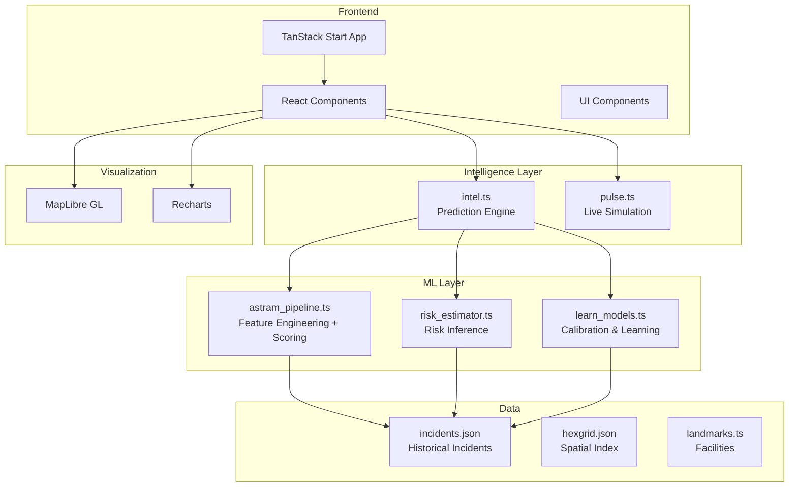

<p align="center">
  
  
  
  
  
  
</p>

<h1 align="center">👁 NETHRA</h1>

<p align="center">
  <strong>Smart City Traffic Operating System for Bengaluru</strong>
</p>

<p align="center">
  <em>An operational decision-support platform for traffic police, planners, and emergency teams that turns historical incident data into actionable intelligence through an incident-driven ML pipeline, spatial analysis, and live simulation.</em>
</p>

---

## 📋 Table of Contents

- [Overview](#-overview)
- [ML Pipeline](#-ml-pipeline)
- [Dashboard Modules](#-dashboard-modules)
- [Architecture](#-architecture)
- [Tech Stack](#-tech-stack)
- [Getting Started](#-getting-started)
- [Project Structure](#-project-structure)
- [How It Works](#-how-it-works)

---

## 🎯 Overview

NETHRA is a traffic command-center platform for Bengaluru that ingests historical incident records, builds an internal ML-style reasoning layer from them, and exposes that intelligence through interactive dashboards for risk scoring, impact analysis, diversion planning, and learning feedback.

The system uses a lightweight ASTraM-inspired pipeline implemented in TypeScript so predictions can run quickly in the browser and be explained through incident similarity, feature engineering, and historical calibration.

---

## 🤖 ML Pipeline

NETHRA’s intelligence layer is built around a practical, incident-driven pipeline that mirrors the flow below:

1. **Data ingestion**  
   Historical incidents are loaded from the local dataset in [src/data/incidents.json](src/data/incidents.json) and related sources in [src/data/astram.csv](src/data/astram.csv).

2. **Feature engineering**  
   The pipeline derives structured features from each incident, including severity, priority, closure state, corridor relevance, local density, proximity, crowd pressure, and duration.

3. **Lightweight learned scoring**  
   A deterministic, LightGBM-style weighted scorer in [src/ml/astram_pipeline.ts](src/ml/astram_pipeline.ts) combines those features into risk, delay, confidence, and impact-radius estimates.

4. **Similar-incident retrieval**  
   The same module performs k-NN-style matching against historical incidents to surface similar past cases and support explainability.

5. **Learning feedback loop**  
   Predicted-vs-actual calibration points and learning summaries are generated in [src/ml/learn_models.ts](src/ml/learn_models.ts) and consumed by the intelligence layer in [src/lib/intel.ts](src/lib/intel.ts).

### Pipeline Components

| Stage | Implementation |
|:---|:---|
| Feature Engineering | [src/ml/astram_pipeline.ts](src/ml/astram_pipeline.ts) |
| Risk / Delay / Confidence Scoring | [src/ml/astram_pipeline.ts](src/ml/astram_pipeline.ts) |
| Similar Incident Matching | [src/ml/astram_pipeline.ts](src/ml/astram_pipeline.ts) |
| Risk Estimation Entry Point | [src/ml/risk_estimator.ts](src/ml/risk_estimator.ts) |
| Learning & Calibration | [src/ml/learn_models.ts](src/ml/learn_models.ts) |

---

## 📊 Dashboard Modules

| Module | Purpose |
|:---|:---|
| **Command Center** | Live operations view with risk-ranked events and corridor activity |
| **Digital Twin** | 168-hour replay with H3 hex-grid spatial analysis |
| **Create Event** | Event planning with risk and impact prediction |
| **Event Details** | Deep dive into impact, deployment status, and explainability |
| **AI Strategist** | Scenario analysis with historical context and reasoning |
| **Diversion Planner** | Alternate-route suggestions using traffic-aware logic |
| **Resource Optimization** | Resource roll-up for officers, barricades, and patrol planning |
| **Learning Dashboard** | Predicted vs actual monitoring and calibration trends |

---

## 🏗 Architecture



---

## 🛠 Tech Stack

### Frontend

| Technology | Purpose |
|:---|:---|
| React 19.2 | UI framework |
| TanStack Start 1.167 | App framework with routing and SSR |
| TypeScript 5.8 | Type-safe application logic |
| Tailwind CSS 4.2 | Styling |
| MapLibre GL 5.24 | Map visualization |
| H3-js 4.4 | Hex-grid spatial indexing |
| Recharts 2.15 | Charts and analytics |
| Vite 8.0 | Build and dev tooling |

### ML & Data

| Technology | Purpose |
|:---|:---|
| Pure TypeScript ML pipeline | No external model runtime required |
| incidents.json | Historical incident dataset |
| astram.csv | Raw dataset source |
| hexgrid.json | Spatial index for geospatial analysis |

---

## 🚀 Getting Started

### Prerequisites

- Node.js 18+
- Bun (optional) or npm
- Git

### Install and run

```bash
git clone https://github.com/Pragati1466/Nethra.git
cd Nethra
bun install
bun run dev
```

Open http://localhost:5173 to view the app.

### Useful scripts

```bash
bun run dev
bun run build
bun run preview
bun run lint
bun run format
```

---

## 📁 Project Structure

```text
src/
  ml/
    astram_pipeline.ts
    risk_estimator.ts
    learn_models.ts
  lib/
    intel.ts
    pulse.ts
    impact.ts
  data/
    incidents.json
    astram.csv
    hexgrid.json
    landmarks.ts
  routes/
    index.tsx
    twin.tsx
    events.new.tsx
    events.$eventId.tsx
    strategist.tsx
    diversion.tsx
    resources.tsx
    learn.tsx
    demo.tsx
```

---

## ⚙️ How It Works

1. **Event input** — A user creates or reviews an event with location, crowd, duration, and incident context.
2. **Feature extraction** — The pipeline builds a feature bundle from nearby historical incidents and incident metadata.
3. **Prediction** — A weighted scoring function estimates risk, delay, confidence, and impact radius.
4. **Similarity matching** — Nearby historical incidents are retrieved to provide context and explainability.
5. **Learning feedback** — Predicted outcomes are compared against historical outcomes to create calibration and performance insights.

This makes the platform feel like a lightweight, explainable decision engine rather than a black-box model.

---

<p align="center">
  <strong>Built for Bengaluru Traffic Police 🏙️</strong>
</p>

<p align="center">
  <a href="https://github.com/Pragati1466/Nethra">GitHub Repository</a> ·
  <a href="https://nethra-one.vercel.app/">Live Demo</a>
</p>
