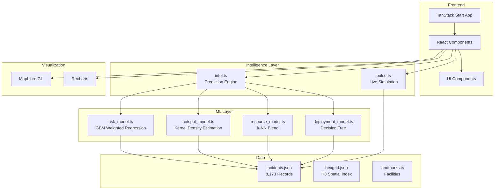

<p align="center">
  
  
  
  
  
  
</p>

<h1 align="center">👁 NETHRA</h1>

<p align="center">
  <strong>Smart City Traffic Operating System for Bengaluru</strong>
</p>

<p align="center">
  <em>An operational decision-making platform for traffic police, planners, and emergency response that transforms raw incident data into actionable intelligence through predictive modeling, spatial analysis, and real-time simulation.</em>
</p>

---

## 📋 Table of Contents

- [Overview](#-overview)
- [Core Capabilities](#-core-capabilities)
- [Dashboard Modules](#-dashboard-modules)
- [Architecture](#-architecture)
- [Dashboard Previews](#-dashboard-previews)
- [ML Model Integration](#-ml-model-integration)
- [Tech Stack](#-tech-stack)
- [Getting Started](#-getting-started)
- [Project Structure](#-project-structure)
- [How It Works](#-how-it-works)

---

## 🎯 Overview

NETHRA is a production-grade traffic command center platform built for **Bengaluru traffic police**. It ingests a real incident dataset (Astram) with 8,173+ historical records, processes it through a multi-stage ML pipeline, and serves an interactive operator console where personnel can:

- **Predict** event risk scores (0–100) using gradient-boosted weighted regression
- **Visualize** traffic patterns through a 168-hour digital twin with H3 hex grid spatial analysis
- **Assess** citizen impact, economic loss, and emergency access risk
- **Plan** smart diversion routes with traffic-aware alternate routing
- **Deploy** resources using ML-powered recommendations for officers, barricades, and patrols
- **Monitor** live operations through a real-time pulse simulation
- **Analyze** historical patterns through interactive learning dashboards

The system operates as a single-page React application with all ML models loaded into memory at startup for sub-second inference, trained on historical Bengaluru traffic incident data.

---

## 🔥 Core Capabilities

| Capability | Description |
|:---|:---|
| **Predictive Risk Modeling** | Gradient-boosted weighted regression model that scores events (0–100) based on 8,173+ historical incidents, using spatial hotspot analysis, crowd pressure indexing, temporal risk factors, and cause pattern learning. |
| **Digital Twin Replay** | 168-hour traffic replay with H3 hexagonal spatial indexing (res-9) that visualizes incident density, corridor stress, and temporal patterns across Bengaluru's road network. |
| **Impact Assessment** | Quantifies citizen impact radius, estimated delay minutes, affected junctions and corridors, and economic loss projections using kernel density estimation. |
| **Smart Diversion Planning** | Traffic-aware alternate route generation that considers corridor load, capacity constraints, and historical closure patterns to recommend optimal bypass routes. |
| **ML Resource Deployment** | k-NN blend model that recommends optimal officer count, barricade count, patrol units, and mobile units based on risk score, crowd size, duration, and historical incident patterns. |
| **Decision Tree Deployment Planning** | Learned decision tree structure that outputs staged deployment plans (pre-event, on-event, post-event) with specific actions, timings, and priorities across ALPHA/BRAVO/CHARLIE tiers. |
| **Live Operations Pulse** | Real-time simulation of field units, corridor congestion, feed streams, and alerts that updates every 2.5 seconds to provide a live city feel. |
| **AI Strategist** | Chat-based assistant for scenario analysis that provides explainable predictions with factor decomposition, similar historical outcomes, and junction DNA analysis. |
| **Learning Dashboard** | Model performance tracking with predicted vs actual comparisons, weekly accuracy trends, calibration bins, and historical performance ledger. |

---

## 📊 Dashboard Modules

| # | Module | What it does |
|:---:|:---|:---|
| 1 | **Command Center** | Live operations dashboard with risk-ranked events, real-time corridor congestion, field unit tracking, and alert streaming. |
| 2 | **Digital Twin** | 168-hour traffic replay with H3 hex grid spatial analysis, incident density visualization, and temporal pattern exploration. |
| 3 | **Create Event** | Plan new events with ML-powered risk prediction, impact assessment, and resource recommendations. |
| 4 | **Event Details** | View event details, impact analysis, deployment status, diversion routes, and ML explainability. |
| 5 | **AI Strategist** | Chat-based AI assistant for scenario analysis with explainable predictions and factor decomposition. |
| 6 | **Diversion Planner** | Traffic-aware route planning with capacity analysis, detour time estimation, and corridor coverage mapping. |
| 7 | **Resource Optimization** | City-wide resource roll-up showing officer, barricade, and patrol allocation across all events. |
| 8 | **Learning Dashboard** | Model performance tracking with predicted vs actual comparisons, weekly accuracy trends, and calibration analysis. |
| 9 | **Demo Mode** | 90-second cinematic demo of all features with automated scenario walkthrough. |

---

## 🏗 Architecture

NETHRA follows a client-side ML architecture with four integrated models:



---

## 🖼 Dashboard Previews

<div align="center">

| Module | Preview |
|:---:|:---|
| **Command Center** |  |
| **Digital Twin** |  |
| **Event Creation** |  |
| **AI Strategist** |  |
| **Learning Dashboard** |  |
| **Demo Mode** |  |

</div>

---

## 🤖 ML Model Integration

NETHRA integrates four custom ML models trained on 8,173+ historical Bengaluru traffic incidents. All models are implemented in pure TypeScript with no external ML library dependencies, ensuring fast in-browser inference.

### Model 1: Risk Model (Gradient-Boosted Weighted Regression)

**File:** `src/ml/risk_model.ts`

**Architecture:** Ensemble of 4 weak learners whose residuals are corrected by subsequent stages, mimicking Gradient Boosting Machines without requiring a runtime ML framework.

**Features:**
- Spatial hotspot scoring via Gaussian kernel density estimation
- Crowd pressure indexing based on event type multipliers
- Temporal risk scoring (peak-hour sensitivity, weekend vs weekday)
- Cause pattern learning from historical incident types

**Training Process:**
1. Spatial learner builds grid bins (~1.1km cells) with closure rate and high-priority rate aggregation
2. Cause prior learner calculates risk boost per incident cause (0–30 range)
3. Corridor frequency learner normalizes corridor weights
4. GBM-style boosting applies sequential corrections: spatial → crowd → temporal → cause

**Output:** Risk score (0–100), confidence (0–100), feature importance weights, ML contribution delta, and explainable reasoning.

```typescript
// Example prediction
const risk = predictRisk({
  lat: 12.9716,
  lng: 77.5946,
  crowdSize: 25000,
  durationHours: 4,
  eventKindBase: 65,
  crowdMultiplier: 1.2,
  hourOfDay: 18,
  dayOfWeek: 5
});
// Returns: { riskScore: 78, confidence: 82, mlContribution: +12, ... }
```

### Model 2: Hotspot Model (Kernel Density Estimation)

**File:** `src/ml/hotspot_model.ts`

**Architecture:** Gaussian KDE with Silverman's rule of thumb bandwidth selection, producing per-location density scores and corridor/junction stress rankings.

**Features:**
- KDE density calculation at queried point (0–1 normalized)
- Estimated impact radius derived from local density
- Corridor stress scores (incident frequency × closure rate blend)
- Junction stress rankings with incident concentration
- Time-of-day heatmap buckets (peak hours per zone)

**Training Process:**
1. Bandwidth selection using Silverman's rule: h = 1.06 × std_dev × n^(-1/5)
2. Incident weighting: closures get 2×, High priority gets 1.5×
3. Corridor stats aggregation (count, closure rate)
4. Junction stats aggregation with centroid calculation
5. Global max density estimation via sampling

**Output:** Density score, estimated radius, stressed corridors/junctions, peak hours, and reasoning.

```typescript
// Example query
const hotspot = queryHotspot(12.9716, 77.5946, 3.0);
// Returns: { densityScore: 0.73, estimatedRadiusKm: 2.8, stressedCorridors: [...], ... }
```

### Model 3: Resource Model (k-NN Blend)

**File:** `src/ml/resource_model.ts`

**Architecture:** k-nearest neighbors lookup blended with rule-grounded crowd formula and corridor priors, using inverse distance weighting.

**Features:**
- Tier-based resource multipliers (High/Medium/Low priority)
- k-NN resource estimation from historical incidents (k=25)
- Corridor-specific resource priors from incident concentration
- Risk and duration scaling factors
- VIP event bonus multipliers

**Training Process:**
1. Tier stats learning from priority distribution
2. Closure rate-based multiplier adjustment (+40% for closures)
3. Per-corridor resource priors from incident frequency
4. Staging point generation from known police stations

**Output:** Officer count, barricade count, patrol count, mobile units, staging points, confidence, and reasoning.

```typescript
// Example recommendation
const resources = recommendResources(
  { lat: 12.9716, lng: 77.5946, crowdSize: 25000, durationHours: 4, riskScore: 78, ... },
  ["MG Road", "Brigade Road"],
  ["Trinity", "Richmond Circle"]
);
// Returns: { officers: 42, barricades: 28, patrols: 10, mobileUnits: 4, ... }
```

### Model 4: Deployment Model (Decision Tree)

**File:** `src/ml/deployment_model.ts`

**Architecture:** Learned decision tree structure with split thresholds derived from historical incident distributions, producing staged deployment plans.

**Features:**
- Decision tree with risk and crowd split thresholds
- Three deployment tiers: ALPHA (critical), BRAVO (elevated), CHARLIE (standard)
- Phase-based action generation (pre-event, on-event, post-event)
- ML-driven vs rule-based action classification
- Estimated setup time per tier

**Training Process:**
1. Threshold learning from incident priority percentiles (P75, P50)
2. Crowd threshold from Bengaluru norms (15,000 attendees)
3. Tree construction with risk ≥ P75 root split
4. Action templates per tier with dynamic resource allocation

**Output:** Deployment tier, tier label, phased actions (pre/on/post), total actions, setup time, confidence, and reasoning.

```typescript
// Example plan
const deployment = buildDeploymentPlan({
  riskScore: 78,
  crowdSize: 25000,
  durationHours: 4,
  officers: 42,
  barricades: 28,
  mobileUnits: 4,
  ...
});
// Returns: { tier: "alpha", tierLabel: "ALPHA — Full Deployment", phases: {...}, ... }
```

### Model Integration Flow

All four models are integrated through `src/lib/intel.ts` in the `predictImpact()` function:

1. **Risk Model** predicts base risk score with ML corrections
2. **Hotspot Model** refines impact radius and corridor/junction selection
3. **Resource Model** recommends officer/barricade counts
4. **Deployment Model** generates staged deployment plan
5. **Blending** with rule-based logic for explainability anchors
6. **Eager warmup** at module load via `requestIdleCallback` for zero-latency first prediction

```typescript
// Integration in intel.ts
const mlRisk = predictRisk({ lat, lng, crowdSize, durationHours, ... });
const hotspot = queryHotspot(lat, lng, 3.0);
const mlResources = recommendResources({ lat, lng, riskScore, ... }, corridors, junctions);
const mlDeployment = buildDeploymentPlan({ riskScore, officers, barricades, ... });
```

---

## 🛠 Tech Stack

### Frontend

| Technology | Version | Purpose |
|:---|:---:|:---|
| React | 19.2 | Component-based UI framework |
| TanStack Start | 1.167 | React-based SSR framework with file-based routing |
| TypeScript | 5.8 | Type-safe development |
| Tailwind CSS | 4.2 | Utility-first CSS framework |
| MapLibre GL | 5.24 | Interactive map rendering |
| H3-js | 4.4 | Hexagonal spatial indexing |
| Recharts | 2.15 | Declarative charting library |
| Radix UI | Latest | Accessible component primitives |
| Vite | 8.0 | Build tool with HMR |

### ML & Data

| Technology | Purpose |
|:---|:---|
| Pure TypeScript ML | All models implemented without external ML libraries |
| incidents.json | 8,173+ historical Bengaluru traffic incidents |
| hexgrid.json | H3 res-9 hexagonal spatial index for Bengaluru |
| landmarks.ts | Facility and police station reference data |

### Infrastructure

| Technology | Purpose |
|:---|:---|
| Vercel | Production deployment platform |
| Nitro | Server-side rendering engine |

---

## 🚀 Getting Started

### Prerequisites

| Requirement | Minimum Version |
|:---|:---|
| Node.js | 18+ |
| Bun (optional) | Latest |
| Git | Any |

### Option 1 — Bun (Recommended)

```bash
# Clone the repository
git clone https://github.com/Pragati1466/Nethra.git
cd Nethra

# Install dependencies
bun install

# Start development server
bun run dev
```

### Option 2 — npm

```bash
# Clone the repository
git clone https://github.com/Pragati1466/Nethra.git
cd Nethra

# Install dependencies
npm install

# Start development server
npm run dev
```

- **Development:** `http://localhost:5173` 
- **API Docs:** Auto-generated by TanStack Start

### Build for Production

```bash
# Build the application
bun run build  # or npm run build

# Preview production build
bun run preview  # or npm run preview
```

### Available Scripts

| Script | Description |
|:---|:---|
| `bun run dev` | Start development server with HMR |
| `bun run build` | Build for production |
| `bun run preview` | Preview production build locally |
| `bun run lint` | Run ESLint |
| `bun run format` | Format code with Prettier |

---

## 📁 Project Structure

```
Nethra/
├── photos/                           # Screenshot assets for README
│   ├── 1.png
│   ├── 2.png
│   ├── 3.png
│   ├── 4.png
│   ├── 5.png
│   └── 6.png
│
├── src/
│   ├── ml/                          # ML model implementations
│   │   ├── risk_model.ts            # Gradient-boosted weighted regression
│   │   ├── hotspot_model.ts         # Kernel density estimation
│   │   ├── resource_model.ts        # k-NN blend resource optimizer
│   │   └── deployment_model.ts      # Decision tree deployment planner
│   │
│   ├── lib/                         # Core business logic
│   │   ├── intel.ts                # Prediction engine & ML integration
│   │   ├── pulse.ts                # Live operations simulation
│   │   └── impact.ts               # Citizen impact assessment
│   │
│   ├── data/                        # Static datasets
│   │   ├── incidents.json          # 8,173+ historical incidents
│   │   ├── hexgrid.json            # H3 spatial index
│   │   ├── hexgrid.ts              # TypeScript export
│   │   ├── astram.csv              # Raw incident dataset
│   │   └── landmarks.ts            # Facility reference data
│   │
│   ├── routes/                      # TanStack Start file-based routing
│   │   ├── __root.tsx              # Root layout
│   │   ├── index.tsx               # Command Center
│   │   ├── twin.tsx                # Digital Twin
│   │   ├── events.new.tsx          # Create Event
│   │   ├── events.$eventId.tsx     # Event Details
│   │   ├── strategist.tsx          # AI Strategist
│   │   ├── diversion.tsx           # Diversion Planner
│   │   ├── resources.tsx           # Resource Optimization
│   │   ├── learn.tsx               # Learning Dashboard
│   │   ├── demo.tsx                # Demo Mode
│   │   └── brief.tsx               # Executive Brief generator
│   │
│   ├── components/                  # React components
│   │   ├── ui/                     # Radix UI primitives
│   │   ├── map/                    # MapLibre GL components
│   │   └── charts/                 # Recharts components
│   │
│   ├── hooks/                       # Custom React hooks
│   ├── styles.css                   # Global styles
│   ├── router.tsx                   # TanStack Router config
│   └── start.ts                     # Application entry point
│
├── package.json                     # Dependencies and scripts
├── tsconfig.json                    # TypeScript configuration
├── vite.config.ts                   # Vite build configuration
├── tailwind.config.js               # Tailwind CSS configuration
├── components.json                  # shadcn/ui configuration
├── vercel.json                      # Vercel deployment config
├── .gitignore                       # Git ignore rules
├── LICENSE                          # MIT License
├── README.md                        # This file
└── TODO.md                          # Project roadmap
```

---

## ⚙️ How It Works

### ML Prediction Pipeline

1. **Event Input** — User enters event details (location, crowd size, duration, event type) through the Create Event form.

2. **Risk Prediction** — The risk_model applies GBM-style weighted regression:
   - Spatial learner scores location hotness via KDE
   - Crowd learner calculates pressure index
   - Temporal learner applies peak-hour/weekend multipliers
   - Cause learner adds pattern-based risk boost
   - Sequential boosting corrects residuals at each stage

3. **Hotspot Analysis** — The hotspot_model performs KDE:
   - Gaussian kernel density estimation at event point
   - Corridor stress ranking by closure rate × frequency
   - Junction stress ranking by incident concentration
   - Peak hour bucket identification for the zone

4. **Resource Recommendation** — The resource_model blends three approaches:
   - Rule-grounded crowd formula (officers per 1k attendees)
   - k-NN lookup from 25 nearest historical incidents
   - Corridor-specific priors from incident concentration
   - Risk and duration scaling with VIP bonus

5. **Deployment Planning** — The deployment_model traverses decision tree:
   - Risk ≥ P75 split determines high-risk subtree
   - Crowd ≥ 15,000 split determines ALPHA tier
   - Generates phased actions (pre/on/post) per tier
   - Estimates setup time and confidence

6. **Explainability** — The intel.ts merges all reasoning:
   - Factor decomposition with weight percentages
   - Similar historical outcomes with match scores
   - Junction DNA with incident counts and closure rates
   - Diversion rationale with pros/cons analysis

### Live Operations Pulse

The pulse.ts module maintains a ticking simulation:

1. **Tick Cycle** — Every 2.5 seconds, the pulse advances one tick
2. **Corridor Dynamics** — Random walk with live event bias
3. **Unit Movement** — Jittered movement along heading with status flips
4. **Alert Generation** — Probabilistic alert spawning with TTL aging
5. **Feed Streaming** — Mix of dispatches, check-ins, sensor readings, intel, and AI suggestions

### Digital Twin Replay

The twin.tsx enables 168-hour traffic replay:

1. **H3 Hex Grid** — Res-9 hexagonal cells over Bengaluru
2. **Temporal Scrubber** — Slider filters incidents by time window
3. **Density Visualization** — Heatmap of incident density per hex
4. **Corridor Stress** — Color-coded by closure rate and frequency
5. **Pattern Detection** — Peak hour and day-of-week analysis

---

<p align="center">
  <strong>Built for Bengaluru Traffic Police 🏙️</strong>
</p>

<p align="center">
  <a href="https://github.com/Pragati1466/Nethra">GitHub Repository</a> · 
  <a href="https://nethra-demo.vercel.app">Live Demo</a>
</p>
