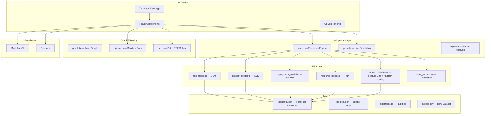

<p align="center">
  
  
  
  
  
  
</p>

<h1 align="center">👁 NETHRA</h1>

<p align="center">
  <strong>Smart City Traffic Operating System for Bengaluru</strong>
</p>

<p align="center">
  <em>An operational decision-support platform for traffic police, planners, and emergency teams that turns historical incident data into actionable intelligence through a multi-model ML pipeline, spatial analysis, graph-based routing, and live simulation.</em>
</p>

---

## 📋 Table of Contents

- [Overview](#-overview)
- [ML Pipeline](#-ml-pipeline)
- [Dashboard Modules](#-dashboard-modules)
- [Architecture](#-architecture)
- [Tech Stack](#-tech-stack)
- [Getting Started](#-getting-started)
- [Project Structure](#-project-structure)
- [How It Works](#-how-it-works)

---

## 🎯 Overview

NETHRA is a traffic command-center platform for Bengaluru that ingests historical incident records, builds an internal ML reasoning layer from them, and exposes that intelligence through interactive dashboards for risk scoring, impact analysis, diversion planning, patrol optimization, audit tracking, and learning feedback.

The system runs four purpose-built ML models entirely in TypeScript — no external model runtimes, no Python backend. Predictions run in the browser and are explained through feature importance, decision paths, KDE density scores, and incident similarity.

---

## 🤖 ML Pipeline

NETHRA's intelligence layer is built around four real ML models trained on-device from `incidents.json`:

### 1. Risk Model — Gradient Boosting Machine (GBM)
`src/ml/risk_model.ts`

A true GBM trained with 25 boosting rounds (learning rate η=0.1) on decision stumps. Each round fits a stump on the negative gradient of the MSE loss. Feature vector: `[lat, lng, hour, day_of_week, closure_flag, priority_score, corridor_frequency]`. Produces a blended risk score (70% GBM + 30% domain prior) with feature importance attribution and per-stump explanations.

### 2. Hotspot Model — Kernel Density Estimation (KDE)
`src/ml/hotspot_model.ts`

Gaussian KDE with bandwidth chosen by Silverman's rule of thumb. Weighted by closure (2×) and high-priority (1.5×) incidents. Outputs a normalized density score (0–1), estimated impact radius, corridor stress rankings, junction stress rankings, and peak-hour buckets for any queried location. Also provides a city-wide heatmap grid for map overlay.

### 3. Deployment Model — ID3 Decision Tree
`src/ml/deployment_model.ts`

A real ID3 tree trained by information-gain splitting (entropy reduction) up to depth 4 with minimum 30 samples per leaf. Features: `[priority_score, closure_flag, hour_bucket, corridor_risk]`. The tree structure emerges from data — it is not hand-coded. Classifies events into deployment tiers (Alpha / Bravo / Charlie) and generates phased action plans (pre-event, on-event, post-event) with per-action resource estimates.

### 4. Resource Model — Multi-Dimensional k-NN
`src/ml/resource_model.ts`

True k-NN (k=15) in 7-dimensional normalized feature space: `[lat, lng, hour, priority, closure, corridor_frequency, zone_encoded]`. Uses inverse-distance weighting across neighbors to estimate officer and barricade demand. Output is then scaled by crowd size, duration, risk score, and VIP flag. Derives staging points from affected corridors and junctions.

### Supporting Pipeline Components

| Stage | Implementation |
|:---|:---|
| Feature engineering + ASTraM scoring | [src/ml/astram_pipeline.ts](src/ml/astram_pipeline.ts) |
| Similar incident matching (k-NN style) | [src/ml/astram_pipeline.ts](src/ml/astram_pipeline.ts) |
| Risk estimation entry point | [src/ml/risk_estimator.ts](src/ml/risk_estimator.ts) |
| Learning & calibration | [src/ml/learn_models.ts](src/ml/learn_models.ts) |
| GBM risk scoring | [src/ml/risk_model.ts](src/ml/risk_model.ts) |
| KDE hotspot analysis | [src/ml/hotspot_model.ts](src/ml/hotspot_model.ts) |
| ID3 deployment planning | [src/ml/deployment_model.ts](src/ml/deployment_model.ts) |
| k-NN resource recommendation | [src/ml/resource_model.ts](src/ml/resource_model.ts) |

---

## 📊 Dashboard Modules

| Module | Route | Purpose |
|:---|:---|:---|
| **Command Center** | `/` | Live operations view with risk-ranked events and corridor activity |
| **Digital Twin** | `/twin` | 168-hour replay with H3 hex-grid spatial analysis |
| **Create Event** | `/events/new` | Event planning with GBM risk and k-NN resource prediction |
| **Event Details** | `/events/:id` | Deep dive into impact, deployment plan, and explainability |
| **AI Strategist** | `/strategist` | Scenario analysis with historical context and reasoning |
| **Diversion Planner** | `/diversion` | ML-driven alternate-route suggestions using graph routing |
| **Patrol Route Optimizer** | `/patrol` | TSP-based multi-incident patrol routing using Dijkstra + nearest-neighbor heuristic |
| **Resource Optimization** | `/resources` | Officer, barricade, and patrol roll-up via k-NN recommendations |
| **Audit Trail** | `/audit` | Immutable system action logs with filtering and export |
| **Learning Dashboard** | `/learn` | Predicted vs actual monitoring and calibration trends |
| **Brief** | `/brief` | Shift briefing summary for command teams |
| **Replay** | `/replay` | Temporal replay of historical incidents |
| **Demo** | `/demo` | Guided walkthrough of platform capabilities |

---

## 🏗 Architecture



---

## 🛠 Tech Stack

### Frontend

| Technology | Purpose |
|:---|:---|
| React 19.2 | UI framework |
| TanStack Start 1.167 | App framework with routing and SSR |
| TypeScript 5.8 | Type-safe application logic |
| Tailwind CSS 4.2 | Styling |
| MapLibre GL 5.24 | Map visualization |
| H3-js 4.4 | Hex-grid spatial indexing |
| Recharts 2.15 | Charts and analytics |
| Vite 8.0 | Build and dev tooling |
| Radix UI | Accessible component primitives |
| React Hook Form + Zod | Form management and validation |

### ML & Algorithms

| Model / Algorithm | File | Purpose |
|:---|:---|:---|
| Gradient Boosting Machine (GBM) | `src/ml/risk_model.ts` | Risk scoring |
| Kernel Density Estimation (KDE) | `src/ml/hotspot_model.ts` | Hotspot + impact radius |
| ID3 Decision Tree | `src/ml/deployment_model.ts` | Deployment tier classification |
| k-Nearest Neighbors (k-NN) | `src/ml/resource_model.ts` | Resource demand estimation |
| ASTraM-inspired pipeline | `src/ml/astram_pipeline.ts` | Feature engineering + similarity |
| Dijkstra shortest path | `src/lib/dijkstra.ts` | Route optimization |
| TSP nearest-neighbor heuristic | `src/lib/tsp.ts` | Patrol route planning |

### Data

| Asset | Purpose |
|:---|:---|
| `src/data/incidents.json` | Historical incident dataset (training data) |
| `src/data/astram.csv` | Raw ASTraM dataset source |
| `src/data/hexgrid.json` | Spatial index for H3 hex-grid analysis |
| `src/data/landmarks.ts` | Bengaluru facility and landmark locations |

---

## 🚀 Getting Started

### Prerequisites

- Node.js 18+
- Bun (recommended) or npm
- Git

### Install and run

```bash
git clone https://github.com/Pragati1466/Nethra.git
cd Nethra
bun install
bun run dev
```

Open http://localhost:5173 to view the app.

### Useful scripts

```bash
bun run dev        # start dev server
bun run build      # production build
bun run preview    # preview production build
bun run lint       # ESLint
bun run format     # Prettier
```

---

## 📁 Project Structure

```text
src/
  ml/
    risk_model.ts          # GBM risk scoring
    hotspot_model.ts       # KDE hotspot analysis
    deployment_model.ts    # ID3 deployment tree
    resource_model.ts      # k-NN resource estimation
    astram_pipeline.ts     # Feature engineering + ASTraM scoring
    risk_estimator.ts      # Risk estimation entry point
    learn_models.ts        # Calibration & learning feedback
    model_store.ts         # Shared model state
    index.ts               # Public ML exports
  lib/
    intel.ts               # Prediction engine
    pulse.ts               # Live simulation
    impact.ts              # Impact analysis
    dijkstra.ts            # Shortest path routing
    graph.ts               # Road graph construction
    tsp.ts                 # TSP patrol solver
    audit.ts               # Audit trail logging
    tiw_store.ts           # Twin/intel state store
    closed_intel_store.ts  # Closed intel state
  data/
    incidents.json
    astram.csv
    hexgrid.json
    landmarks.ts
  components/
    nethra/
      AppShell.tsx
      CityMap.tsx
      TwinMap.tsx
      RiskGauge.tsx
      Explainability.tsx
      ImpactPanel.tsx
      LiveOps.tsx
      PatrolRoute.tsx       # TSP patrol route optimizer UI
      AuditDashboard.tsx    # Audit trail UI
      UnitAssignmentHistory.tsx
  routes/
    index.tsx              # Command center
    twin.tsx               # Digital twin
    events.new.tsx         # Create event
    events.$eventId.tsx    # Event details
    strategist.tsx         # AI strategist
    diversion.tsx          # Diversion planner
    patrol.tsx             # Patrol route optimizer
    resources.tsx          # Resource optimization
    audit.tsx              # Audit trail
    learn.tsx              # Learning dashboard
    brief.tsx              # Shift brief
    replay.tsx             # Incident replay
    demo.tsx               # Demo walkthrough
```

---

## ⚙️ How It Works

1. **Event input** — A user creates or reviews an event with location, crowd size, duration, and incident context.
2. **Feature extraction** — The pipeline builds a feature bundle from nearby historical incidents and event metadata.
3. **Multi-model prediction** — Four models run in parallel:
   - GBM produces a risk score with feature importance attribution.
   - KDE produces a hotspot density score and impact radius.
   - ID3 tree classifies the deployment tier and generates a phased action plan.
   - k-NN recommends officers, barricades, patrols, and staging points.
4. **Routing** — For diversion planning, Dijkstra finds shortest alternate paths on the road graph. For patrol scheduling, a TSP nearest-neighbor heuristic sequences multi-incident routes.
5. **Similarity matching** — The ASTraM pipeline retrieves similar historical incidents to support explainability.
6. **Learning feedback** — Predicted outcomes are compared against historical outcomes to generate calibration and performance insights on the Learning Dashboard.
7. **Audit trail** — All system actions are logged to an immutable audit trail accessible at `/audit`.

All ML runs client-side in TypeScript — no server round-trips, no external model APIs.

---

<p align="center">
  <strong>Built for Bengaluru Traffic Police 🏙️</strong>
</p>

<p align="center">
  <a href="https://github.com/Pragati1466/Nethra">GitHub Repository</a> ·
  <a href="https://nethra-one.vercel.app/">Live Demo</a>
</p>
