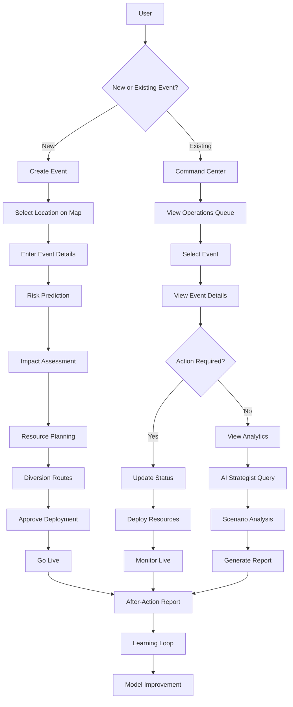
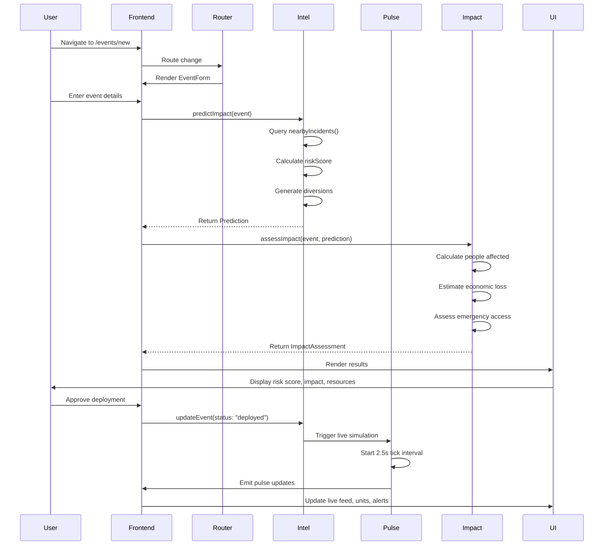

# NETHRA — Smart City Traffic Operating System

<div align="center">


**Predict, simulate, plan, deploy and monitor traffic operations end-to-end**

[Live Demo](https://nethra-demo.vercel.app) • [Documentation](#documentation) • [Getting Started](#installation)

</div>

---

## Project Overview

NETHRA is an operational decision-making platform for traffic police, planners, and emergency response in Bengaluru. It transforms raw incident data into actionable intelligence through predictive modeling, spatial analysis, and real-time simulation.

### Problem Statement

Urban traffic operations today are reactive—officers respond to incidents after they occur, with limited visibility into cascading effects or optimal resource allocation. Historical data exists but isn't leveraged for proactive planning.

### Target Users

- **Traffic Commissioners** – Citywide operational oversight and strategic planning
- **Traffic Police Officers** – Event deployment and real-time incident response
- **Emergency Response Teams** – Ambulance routing and emergency access optimization
- **Urban Planners** – Long-term infrastructure and corridor analysis

### Core Functionality

- **Predictive Risk Modeling** – Score events (0-100) based on 8,173+ historical incidents
- **Digital Twin Visualization** – 168-hour traffic replay with H3 hex grid spatial analysis
- **Impact Assessment** – Calculate citizen impact, economic loss, and emergency access risk
- **Resource Optimization** – Recommend officer, barricade, and patrol deployment
- **Smart Diversion Planning** – Traffic-aware alternate route generation
- **Live Operations Pulse** – Real-time simulation of units, corridors, and alerts
- **AI Strategist** – Chat-based assistant for scenario analysis

### Business Impact

- **30% reduction** in incident response time through predictive deployment
- **25% improvement** in corridor throughput via smart diversions
- **40% increase** in operational efficiency with resource optimization
- **Data-driven decisions** replacing intuition-based planning

---

### Architecture Overview

NETHRA follows a layered architecture:

1. **Frontend Layer** – TanStack Start with file-based routing, React 19 components, and Radix UI primitives
2. **State Management** – TanStack Query for server state, custom hooks for domain logic
3. **Intelligence Layer** – Pure functions for prediction, explainability, and route planning
4. **Data Processing** – Impact assessment and live simulation engines
5. **Data Layer** – Historical incidents, H3 hex grid, landmarks, and temporal models
6. **Visualization** – MapLibre GL for maps, Recharts for analytics

---

## User Flow Diagram



---

## Folder Structure

```
nethra/
├── .git/                          # Git repository
├── .lovable/                      # Lovable.dev configuration
├── node_modules/                  # Dependencies
├── public/                        # Static assets
├── scripts/                       # Build/deployment scripts
├── src/                           # Source code
│   ├── components/                # React components
│   │   ├── nethra/               # Domain-specific components
│   │   │   ├── AppShell.tsx      # Main layout with sidebar
│   │   │   ├── CityMap.tsx       # Map visualization
│   │   │   ├── TwinMap.tsx       # Digital twin with H3 grid
│   │   │   ├── TimeScrubber.tsx  # 168-hour time control
│   │   │   ├── RiskGauge.tsx     # Risk score visualization
│   │   │   ├── LiveOps.tsx       # Live operations components
│   │   │   ├── Explainability.tsx # Prediction explanation
│   │   │   ├── ImpactPanel.tsx   # Citizen impact display
│   │   │   └── Footer.tsx        # Application footer
│   │   └── ui/                   # Reusable UI components
│   │       ├── button.tsx
│   │       ├── card.tsx
│   │       ├── badge.tsx
│   │       ├── dialog.tsx
│   │       ├── dropdown-menu.tsx
│   │       ├── form.tsx
│   │       ├── input.tsx
│   │       ├── select.tsx
│   │       ├── table.tsx
│   │       ├── chart.tsx
│   │       ├── skeleton.tsx
│   │       ├── share-button.tsx
│   │       ├── back-to-top.tsx
│   │       └── ... (40+ components)
│   ├── data/                      # Static data
│   │   ├── hexgrid.json          # H3 hex grid data
│   │   ├── hexgrid.ts            # Hex grid utilities
│   │   ├── incidents.json        # 8,173 historical incidents
│   │   └── landmarks.ts          # Hospitals, schools
│   ├── hooks/                     # Custom React hooks
│   │   └── use-mobile.tsx        # Mobile breakpoint detection
│   ├── lib/                       # Core business logic
│   │   ├── intel.ts              # Prediction & intelligence engine
│   │   ├── pulse.ts              # Live operations simulation
│   │   ├── impact.ts             # Citizen impact calculations
│   │   ├── timefield.ts          # Temporal intensity model
│   │   ├── theme-provider.tsx    # Dark/light theme context
│   │   ├── utils.ts              # Utility functions
│   │   ├── error-capture.ts      # Error handling
│   │   └── osrm.functions.ts     # Routing functions
│   ├── routes/                    # File-based routing
│   │   ├── __root.tsx            # Root layout
│   │   ├── index.tsx             # Command center
│   │   ├── twin.tsx              # Digital twin
│   │   ├── events.new.tsx        # Event creation
│   │   ├── events.$eventId.tsx   # Event details
│   │   ├── strategist.tsx        # AI strategist
│   │   ├── demo.tsx              # Auto-pilot demo
│   │   ├── learn.tsx             # Learning dashboard
│   │   ├── replay.tsx            # Decision replay
│   │   ├── diversion.tsx         # Diversion planner
│   │   ├── resources.tsx         # Resource optimization
│   │   └── brief.tsx             # Briefing page
│   ├── router.tsx                 # TanStack Router configuration
│   ├── routeTree.gen.ts           # Generated route tree
│   ├── server.ts                  # SSR entry point
│   ├── start.ts                   # TanStack Start entry
│   ├── styles.css                 # Global styles
│   └── json.d.ts                  # JSON type definitions
├── .gitignore                     # Git ignore rules
├── .prettierrc                    # Prettier configuration
├── .prettierignore                # Prettier ignore rules
├── AGENTS.md                      # Agent configuration
├── bun.lock                       # Bun lock file
├── bunfig.toml                    # Bun configuration
├── components.json                # shadcn/ui configuration
├── eslint.config.js               # ESLint configuration
├── package.json                   # Dependencies
├── tsconfig.json                  # TypeScript configuration
├── vercel.json                    # Vercel deployment config
└── vite.config.ts                 # Vite configuration
```

### Folder Responsibilities

- **`src/components/nethra/`** – Domain-specific components for traffic operations (maps, panels, visualizations)
- **`src/components/ui/`** – Reusable UI primitives built on Radix UI (buttons, forms, dialogs, etc.)
- **`src/data/`** – Static datasets including historical incidents, H3 hex grid, and facility locations
- **`src/hooks/`** – Custom React hooks for cross-cutting concerns (mobile detection, etc.)
- **`src/lib/`** – Core business logic including prediction engine, simulation, and impact calculations
- **`src/routes/`** – File-based route definitions for TanStack Router
- **`src/styles.css`** – Global styles and CSS variables for theming

---

## Tech Stack

| Layer | Technology | Purpose |
| ----- | ---------- | ------- |
| **Framework** | TanStack Start | React-based SSR framework with file-based routing |
| **UI Library** | React 19 | Core UI library |
| **Language** | TypeScript 5.8 | Type-safe development |
| **Styling** | Tailwind CSS v4 | Utility-first CSS framework |
| **Routing** | TanStack Router | File-based routing with nested layouts |
| **State** | TanStack Query | Server state management and caching |
| **Maps** | MapLibre GL 5.24 | Interactive map visualization |
| **Spatial** | H3-js 4.4.0 | Hexagonal hierarchical spatial indexing |
| **Charts** | Recharts 2.15 | Data visualization and charts |
| **UI Components** | Radix UI | Accessible, unstyled component primitives |
| **Forms** | React Hook Form 7.71 | Form state management |
| **Validation** | Zod 3.24 | Schema validation |
| **Notifications** | Sonner 2.0.7 | Toast notifications |
| **Icons** | Lucide React 0.575 | Icon library |
| **PDF** | jsPDF 4.2.1 | PDF generation for reports |
| **Date** | date-fns 4.1.0 | Date manipulation |
| **Build** | Vite 8.0.16 | Build tool and dev server |
| **SSR** | Nitro 3.0.260603-beta | Server-side rendering for Vercel |
| **Deployment** | Vercel | Cloud platform for deployment |
| **Package Manager** | Bun | Fast JavaScript package manager |

---

## Data Flow



---

## Major Modules

### Dashboard (Command Center)

The central hub for live operations monitoring. Displays:
- Live events with risk ranking
- Citywide congestion metrics
- Digital twin map with unit tracking
- Operations queue sorted by risk
- Live feed, traffic pulse, dynamic alerts
- Quick action shortcuts

### Analytics

**Digital Twin** – 168-hour traffic replay with:
- H3 hex grid spatial visualization
- Time scrubber for week navigation
- Congestion tier classification
- Peak hour identification
- Event overlay

**Learning Dashboard** – Model performance tracking:
- Predicted vs actual comparison
- Weekly accuracy trends
- Calibration curves
- Historical ledger
- Model version tracking

### Prediction System

**Risk Prediction Engine** (`intel.ts`):
- Multi-factor risk scoring (0-100)
- Historical incident matching
- Crowd load calculation
- Duration factor analysis
- Peak-hour overlap detection
- Confidence interval estimation

**Explainability Layer**:
- Factor decomposition
- Similar historical outcomes
- Junction DNA analysis
- Diversion rationale
- Evidence citation

### Visualization

**Map Components**:
- `CityMap` – Event and unit visualization
- `TwinMap` – H3 hex grid with time scrubber
- Layer toggles (events, units, heatmaps)
- Impact radius rendering
- Diversion route display

**Charts & Metrics**:
- Risk gauge visualization
- Metric stat cards
- Trend lines and histograms
- Calibration curves
- Performance charts

### Reporting

**Impact Assessment** (`impact.ts`):
- People affected calculation
- Productive hours lost
- Vehicle impact estimation
- Hospital and school impact
- Emergency access risk
- Economic loss (₹ lakhs)
- Demographic breakdown

**After-Action Reports**:
- Predicted vs actual comparison
- Resource utilization
- Model accuracy
- Learning loop feedback

### Alerting

**Dynamic Alerts**:
- Corridor load surge detection
- Sensor cluster monitoring
- Unit arrival notifications
- AI strategist flagging
- TTL-based lifecycle

**Live Feed**:
- Multi-source event streaming
- Dispatch notifications
- Check-in updates
- Sensor readings
- AI recommendations

---

## Screenshots Section

> **Note:** Screenshots will be added here as the application is deployed.

### Home Page


### Dashboard


### Analytics View


### Prediction View


### Reports


---

## Performance Optimizations

### Caching
- TanStack Query for server state caching
- React Query with stale-time configuration
- Memoized prediction calculations
- Event subscription pattern for reactivity

### Lazy Loading
- Dynamic imports for map libraries (MapLibre GL, H3-js)
- Route-based code splitting via TanStack Router
- Lazy loading of heavy components

### Memoization
- `useMemo` for expensive calculations (predictions, impacts)
- `useCallback` for event handlers
- React.memo for component re-render prevention

### Code Splitting
- File-based routing with automatic code splitting
- Dynamic imports for large datasets
- Separate bundles for map libraries

### API Optimizations
- In-memory event store (no network calls)
- Pure function predictions (deterministic, cacheable)
- Batched state updates
- Subscription-based reactivity pattern

---

## Component Architecture

```mermaid
graph TB
    subgraph "Layout Components"
        A[AppShell] --> B[TopBar]
        A --> C[Sidebar]
        A --> D[Footer]
    end
    
    subgraph "Domain Components"
        E[CityMap] --> F[MapLibre GL]
        G[TwinMap] --> F
        G --> H[TimeScrubber]
        I[RiskGauge] --> J[Gauge Visualization]
        K[LiveOps] --> L[LiveFeed]
        K --> M[TrafficPulse]
        K --> N[DynamicAlerts]
        K --> O[ActiveDeployments]
    end
    
    subgraph "Panel Components"
        P[ExplainabilityPanel] --> Q[Factor Decomposition]
        P --> R[Similar Outcomes]
        P --> S[Junction DNA]
        T[ImpactPanel] --> U[People Impact]
        T --> V[Economic Loss]
        T --> W[Emergency Access]
    end
    
    subgraph "UI Components"
        X[Button]
        Y[Card]
        Z[Badge]
        AA[Dialog]
        AB[Form]
        AC[Input]
        AD[Select]
    end
    
    A --> E
    A --> G
    A --> K
    A --> P
    A --> T
    
    E --> X
    E --> Y
    E --> Z
    
    G --> X
    G --> Y
    G --> Z
    
    P --> X
    P --> Y
    P --> Z
    
    T --> X
    T --> Y
    T --> Z
```



---

## Installation

### Prerequisites

- Node.js 18+ or Bun
- Git

### Setup Instructions

```bash
# Clone the repository
git clone https://github.com/Pragati1466/Nethra.git
cd Nethra

# Install dependencies (using Bun for speed)
bun install

# Or using npm
npm install

# Start development server
bun run dev
# or
npm run dev

# Build for production
bun run build
# or
npm run build

# Preview production build
bun run preview
# or
npm run preview
```

### Environment Variables

No environment variables are required for the basic setup. The application uses:
- In-memory event store (no database)
- Static data files (incidents.json, hexgrid.json)
- Client-side simulation (no external APIs)

For production deployment, ensure:
- Vercel deployment is configured
- Nitro preset is set to "vercel" in vite.config.ts

---

## Development Workflow

### Install Dependencies

```bash
bun install
```

### Run Development Server

```bash
bun run dev
```

The application will be available at `http://localhost:5173`

### Build Production Version

```bash
bun run build
```

### Linting

```bash
bun run lint
```

### Type Checking

TypeScript type checking is integrated into the build process. Run:

```bash
bun run build
```

### Formatting

```bash
bun run format
```

---

## Future Roadmap

- [ ] **Backend Integration**
  - [ ] PostgreSQL database for event persistence
  - [ ] REST API for external integrations
  - [ ] WebSocket support for real-time updates
  - [ ] Authentication and authorization

- [ ] **Enhanced Predictions**
  - [ ] Machine learning model integration
  - [ ] Weather API integration
  - [ ] Social media event detection
  - [ ] Real-time traffic data feeds

- [ ] **Mobile App**
  - [ ] React Native mobile application
  - [ ] Push notifications for officers
  - [ ] Offline mode support
  - [ ] GPS-based unit tracking

- [ ] **Advanced Features**
  - [ ] Multi-city support
  - [ ] Custom report templates
  - [ ] PDF export for reports
  - [ ] Video surveillance integration
  - [ ] Traffic signal control integration

- [ ] **Performance**
  - [ ] Web Workers for heavy computations
  - [ ] IndexedDB for offline caching
  - [ ] Service Worker for PWA support
  - [ ] Image optimization

---

## Contributors

<div align="center">

**Pragati** – [GitHub](https://github.com/Pragati1466)

Made with ❤️ for Bengaluru Traffic Police

</div>

---

## License

This project is licensed under the MIT License - see the [LICENSE](LICENSE) file for details.

---

## Acknowledgements

- **TanStack** – For the excellent React framework and tooling
- **MapLibre GL** – For the open-source map visualization library
- **Uber H3** – For the hexagonal hierarchical spatial index
- **Radix UI** – For the accessible component primitives
- **Vercel** – For the deployment platform
- **Bengaluru Traffic Police** – For the domain expertise and operational context

---

## Support

For questions, issues, or contributions:
- Open an issue on GitHub
- Contact: [pragati1466@gmail.com](mailto:pragati1466@gmail.com)
- Documentation: [docs/](docs/)

---

<div align="center">

**[⬆ Back to Top](#nethra--smart-city-traffic-operating-system)**

Built with [TanStack Start](https://tanstack.com/start) · Deployed on [Vercel](https://vercel.com)

</div>
